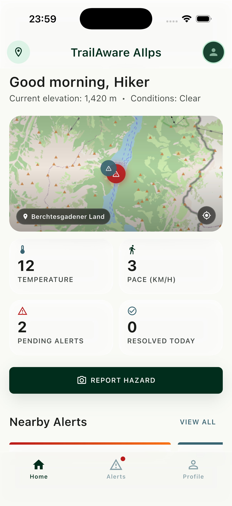
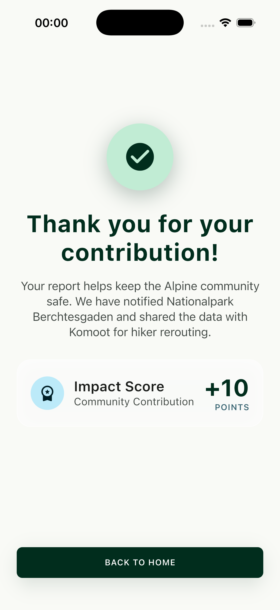
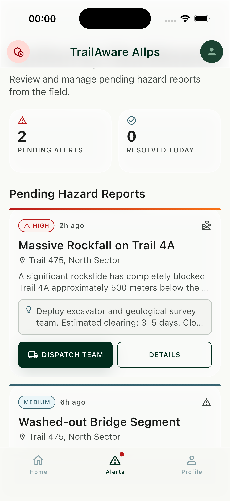
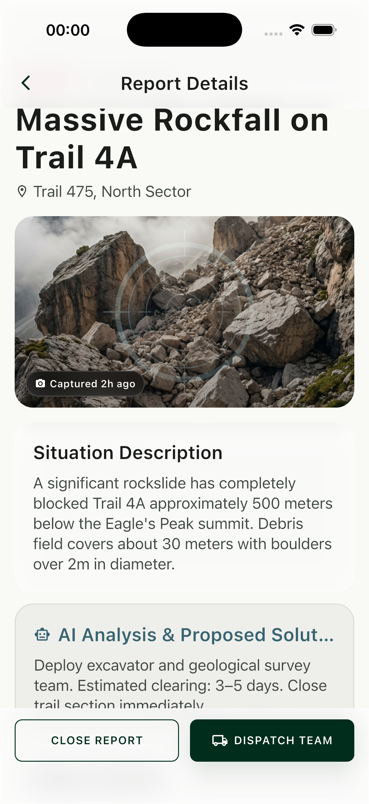
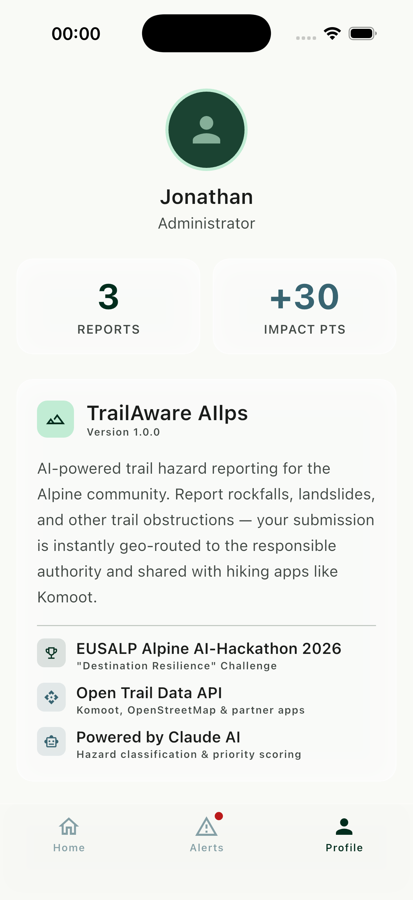

# TrailAware AIlps

> AI-powered trail hazard reporting for the Alpine community.

Built for the **[EUSALP Alpine AI-Hackathon 2026](https://alpine-region.eu/news/detail?tx_news_pi1%5Baction%5D=detail&tx_news_pi1%5Bcontroller%5D=News&tx_news_pi1%5Bnews%5D=378&cHash=014b6051d57da183a98dc6c25c3b23b0)** — *Destination Resilience* challenge. Hikers and mountain bikers report trail hazards via their phone camera. Claude Vision AI classifies each hazard, assigns a priority, and geo-routes the report to the responsible authority. Closed trail data is published via an open API for apps like Komoot to consume.

---

## Screenshots

<p align="center">
  
  &nbsp;
  
  &nbsp;
  
</p>
<p align="center">
  <sub>Home &nbsp;&nbsp;&nbsp;&nbsp;&nbsp;&nbsp;&nbsp;&nbsp;&nbsp;&nbsp;&nbsp;&nbsp;&nbsp;&nbsp;&nbsp;&nbsp;&nbsp;&nbsp;&nbsp;&nbsp;&nbsp;&nbsp;&nbsp;&nbsp;&nbsp;&nbsp;&nbsp; Camera / AI Scan &nbsp;&nbsp;&nbsp;&nbsp;&nbsp;&nbsp;&nbsp;&nbsp;&nbsp;&nbsp;&nbsp;&nbsp;&nbsp;&nbsp;&nbsp;&nbsp;&nbsp;&nbsp;&nbsp;&nbsp;&nbsp;&nbsp;&nbsp;&nbsp;&nbsp;&nbsp; Thank You</sub>
</p>

<p align="center">
  
  &nbsp;
  
  &nbsp;
  
</p>
<p align="center">
  <sub>Authority Dashboard &nbsp;&nbsp;&nbsp;&nbsp;&nbsp;&nbsp;&nbsp;&nbsp;&nbsp;&nbsp;&nbsp;&nbsp;&nbsp;&nbsp;&nbsp;&nbsp;&nbsp;&nbsp; Report Detail &nbsp;&nbsp;&nbsp;&nbsp;&nbsp;&nbsp;&nbsp;&nbsp;&nbsp;&nbsp;&nbsp;&nbsp;&nbsp;&nbsp;&nbsp;&nbsp;&nbsp;&nbsp;&nbsp;&nbsp;&nbsp;&nbsp;&nbsp;&nbsp;&nbsp;&nbsp; Profile</sub>
</p>

---

## How it works

```
User opens camera  →  Claude Vision AI analyses frame
       ↓
Hazard classified (type + priority: high / medium / low)
       ↓
Report geo-routed to responsible authority (national park, alpine club, …)
       ↓
Authority notified  +  trail data pushed to open API (Komoot, OSM, …)
```

---

## Features

| | |
|---|---|
| 📷 **Camera reporting** | Point & capture — AI does the rest |
| 🤖 **Claude Vision AI** | Auto-classifies hazard type and urgency |
| 📍 **Geo-routing** | Report sent to the right authority based on GPS |
| 🗺️ **Live map** | OpenStreetMap with hazard pins on the home screen |
| 🏛️ **Authority dashboard** | Structured overview with dispatch actions |
| 🔗 **Open trail API** | Closed trail data available for third-party apps |
| 🎉 **Thank-you flow** | Impact score screen rewards contributors |

---

## Tech stack

| Layer | Choice |
|---|---|
| Framework | Flutter (iOS-first, Android supported) |
| AI | Claude Vision API (`claude-opus-4-5`) |
| Maps | flutter_map + OpenStreetMap tiles |
| State | Riverpod (`StateNotifierProvider`) |
| Navigation | go_router |
| Design system | Alpine Modernism — glassmorphism, `#012d1d` green palette |

---

## Getting started

```bash
git clone https://github.com/JoDi-2903/TrailAware-AIlps.git
cd TrailAware-AIlps/trail_aware_ailps
flutter pub get
flutter run          # simulator — uses mock camera & mock AI result
```

**For real AI classification** (physical device), create `trail_aware_ailps/.env`:

```
CLAUDE_API_KEY=your-anthropic-api-key
```

> `.env` is gitignored and must never be committed.

---

## Project structure

```
trail_aware_ailps/
├── lib/
│   ├── core/
│   │   ├── models/        # HazardReport, Authority, ClaudeAnalysisResult
│   │   ├── providers/     # Riverpod providers (camera, reports, app mode)
│   │   ├── services/      # ClaudeService, GeolocationService, ReportService
│   │   ├── theme/         # AppColors, AppTextStyles, AppTheme, GlassMorphism
│   │   └── router/        # go_router configuration
│   ├── features/
│   │   ├── home/          # Bento dashboard with live map
│   │   ├── camera/        # AI camera reporter
│   │   ├── success/       # Post-report thank-you screen
│   │   ├── report_detail/ # Full report view with map + AI analysis
│   │   ├── dashboard/     # Authority management dashboard
│   │   └── profile/       # User profile
│   └── shared/widgets/    # GlassPanel, GradientButton, KpiCard, AlertCard …
└── assets/images/         # Mock hazard photos for simulator demo
```

---

## Hackathon context

**Challenge:** How might we strengthen the resilience of Alpine destinations in the face of changing tourism, environmental, and economic conditions?

TrailAware AIlps addresses the growing frequency of trail hazards caused by extreme weather events by creating a fast, AI-assisted feedback loop between hikers and the authorities responsible for trail maintenance.
